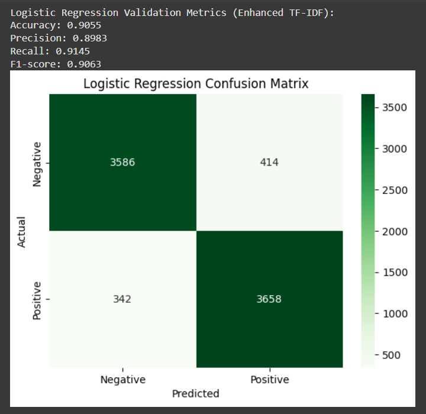
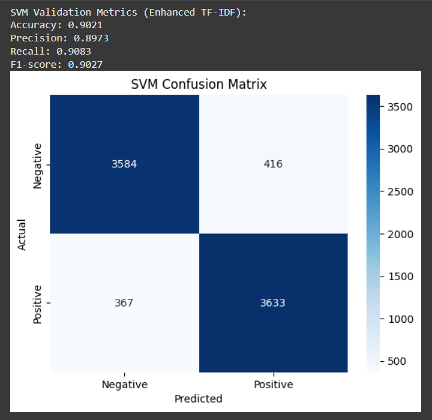
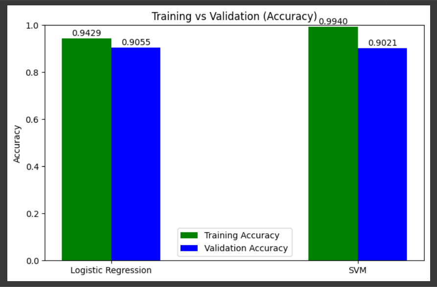
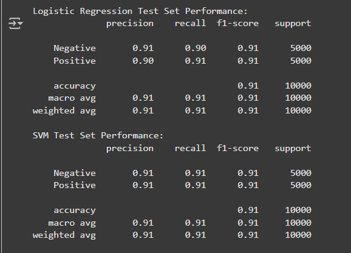
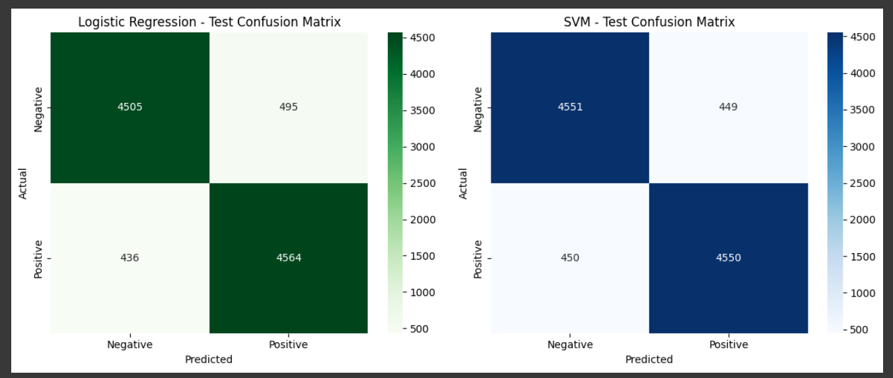
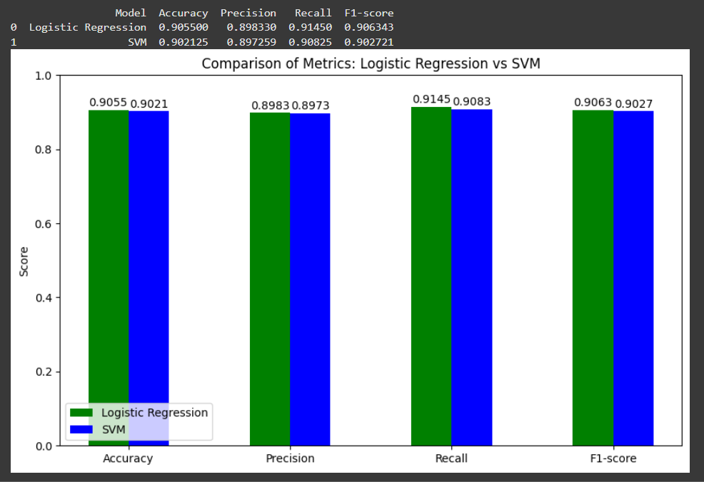

# Sentiment Analysis on IMDb Movie Reviews 🎬

This project implements sentiment classification on the IMDb Movie Review dataset, predicting whether a review is **positive** or **negative**. The focus is on evaluating and comparing multiple traditional machine learning models using enhanced TF-IDF features.

---

## 📂 Dataset  

- **Source:** IMDb Movie Reviews Dataset  
- **Structure:** Two columns:  
  - `review` – the text of the movie review  
  - `sentiment` – label: positive or negative  

The dataset was preprocessed by cleaning HTML tags, special characters, and extra spaces. Texts were lowercased for consistency. The data was split into 64% training, 16% validation, and 20% test to ensure sufficient training examples while keeping enough for validation and unbiased evaluation.

---

## 🛠 Data Preprocessing  

**Text Cleaning:**  
- Removed HTML tags and special characters  
- Converted text to lowercase  
- Removed extra spaces  

**Label Encoding:**  
- positive → 1  
- negative → 0  

---

## 📝 Text Representation  

**TF-IDF (Term Frequency – Inverse Document Frequency)** converts text into numerical features for machine learning:

- **TF (Term Frequency):** how often a word appears in a review:  
  TF(word) = (number of times word appears) / (total words in review)  
- **IDF (Inverse Document Frequency):** how unique a word is across all reviews:  
  IDF(word) = log(total number of reviews / number of reviews containing the word)  
- **TF-IDF:** TF × IDF, gives higher weight to words frequent in a review but rare across all reviews  

Additional Enhancements Applied:  
- Ngrams: unigrams, bigrams, trigrams (`ngram_range=(1,3)`) to capture context and phrase-level sentiment patterns.
- Vocabulary limited to top 30,000 words  
- Sublinear TF scaling (`log(1+tf)`)  to reduce the impact of extremely frequent words.
  
This representation allows the model to focus on the most informative words in each review.

---

## 🧩 Models Implemented  

**1. Logistic Regression**  
- Max iterations: 2000  
- Random state: 42

Logistic Regression provides probabilistic outputs and serves as a strong baseline for text classification.

**2. Linear Support Vector Machine (SVM)**  
- Max iterations: 5000  
- Random state: 42

SVM is effective in high-dimensional spaces like TF-IDF features and also serves as a robust baseline.

---

## Evaluation Metrics  

| Metric    | Definition                                         |
|-----------|---------------------------------------------------|
| Accuracy  | Overall correct predictions                        |
| Precision | Correct positive predictions among predicted positives |
| Recall    | Correct positive predictions among actual positives |
| F1-score  | Harmonic mean of Precision and Recall             |

---

## Validation Results  

| Model               | Accuracy | Precision | Recall | F1-score |
|---------------------|----------|-----------|--------|----------|
| Logistic Regression | 0.9055   | 0.8983    | 0.9145 | 0.9063  |
| SVM                 | 0.9021   | 0.8973    | 0.9083 | 0.9027  |

**Confusion Matrices:**  

    
    

---

## 📈 Training vs Validation Performance  

**Accuracy Comparison:**  

    

**F1-score Comparison:**  

    

*Observation:* Both models generalize well with no significant overfitting.

---

## 🎯 Test Set Performance  

| Model               | Accuracy | Precision | Recall | F1-score |
|---------------------|----------|-----------|--------|----------|
| Logistic Regression | 0.9069   | 0.9022    | 0.9128 | 0.9074  |
| SVM                 | 0.9101   | 0.9102    | 0.9100 | 0.9101  |

**Metrics Comparison:**  

    

  

**Confusion Matrices on Test Set:**  

    

  

*Observation:* SVM slightly outperforms Logistic Regression on the test set, but both models maintain high and stable performance.

---

## 🔍 Comparison between Models  

    

  

*Insight:* Both models achieve consistently high metrics (>89%), confirming that traditional ML methods are effective for sentiment classification on IMDb reviews.

---

## 💡 Key Insights  

- Enhanced TF-IDF features (ngrams + sublinear TF) capture richer sentiment patterns.  
- Both Logistic Regression and SVM are strong baseline models.  
- Metrics and visualizations confirm stable generalization to unseen data.  

---

## ✅ Conclusion  

This project demonstrates a complete pipeline for sentiment classification:

1. Text preprocessing  
2. Feature extraction using enhanced TF-IDF  
3. Training and evaluation of Logistic Regression and SVM  
4. Comprehensive metric comparison with visualization  

---

## 👤 Author  

[Srijani Das](https://github.com/Srijani-Das07)

